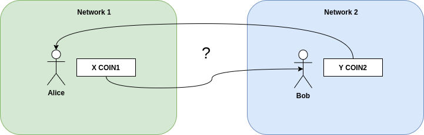
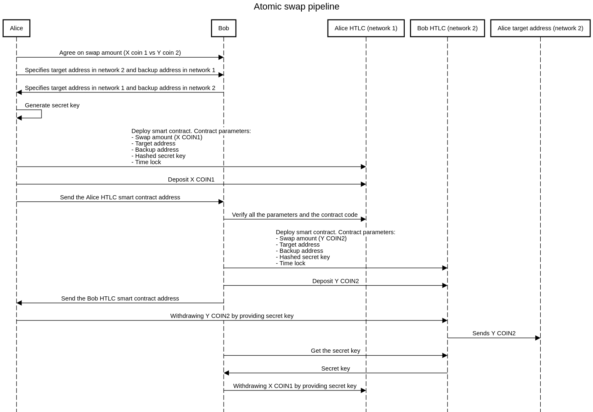
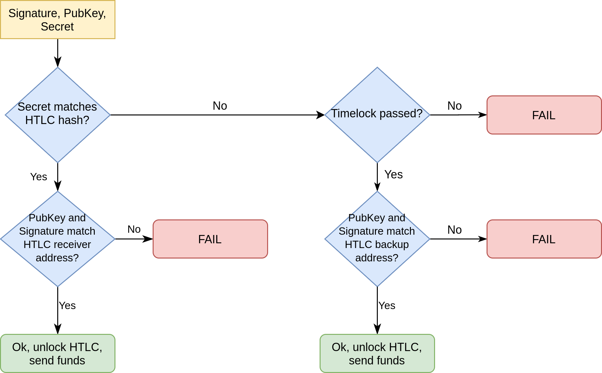

# Broxus atomic-swap network

This repo contains the list of smart contracts and additional tools, which allows anyone to perform atomic swaps with assets, issued on the following blockchains:

- Ethereum
- TON
- Bitcoin

Besides the smart contracts, are also available documentation, tests, FAQ and video tutorials. More specifically, you can use the provided toolbox for exchanging the following assets:

- ETH
- BTC
- Crystal
- Any ERC20 tokens, issued on the Ethereum network (DAI, USDT, LINK, etc)

## Video tutorials

- [Atomic swap between TON and ETH](https://www.youtube.com/watch?v=sIiZ27aIK5I&feature=emb_logo&ab_channel=Broxus)

- [Atomic swap between TON and BTC](https://www.youtube.com/watch?v=_QQa7DJ9pOo&feature=youtu.be&ab_channel=Broxus)

- [Atomic swap between TON and USDT (ERC20)](https://www.youtube.com/watch?v=T3_CzK7KMBo&feature=youtu.be&ab_channel=Broxus)

## Architecture

The whole idea is based on the well-known HTLC contracts, where HTLC means "Hashed Timelock Contract". This section explains this concept in a simple terms.

### Formulation of the problem

Let's imagine that we have two independent networks and each network has an asset used in it. 
On the picture bellow first network's asset is called **COIN1** and the second network's asset is called **COIN2**. 
Also, there're two actors - **Alice**, who has **X COIN1** and **Bob**, who has **Y COIN2**. Imagine, that **Alice** and **Bob** agreed
to exchange their assets with **X / Y** rate. How can they do this without involving the third party?



### Atomic swap pipeline

The HTLC contract can solve this problem. The idea is to lock the assets on the special smart contract with some secret key. After assets are locked, they can be revealed in only two ways:

1. By providing the secret key. In this case, assets are send on the pre-defined address (target address).
2. If the secret key wasn't provided in within the pre-defined time period. In this case, assets are send to the pre-defined address (backup address).



First of all, **Alice** and **Bob** agree on the following:

1. **Alice** sends her **X COIN1** in exchange for **Y COIN2** and vice versa for **Bob**
2. **Alice** provides one address for receiving **COIN2** and another address for refunding her **COIN1** in case the deal falls through. **Bob** do the same vice versa.
3. **Alice** imagine some long hard-to-guess secret. After that she creates the HTLC smart contract with the following details:

    - Swap amount - How much **COIN1** should be locked
    - Target address (aka targetBob) - On which address **COIN1** should be send in case of successful swap (Address controlled by **Bob**)
    - Backup address (aka backupAlice) - On which address **COIN1** should be send in case the deal falls through (Address controlled by **Alice**)
    - Hashed secret key - the hash of the secret key. At the time of creating the contract, this key is known only to **Alice**
    - Time lock - how long must it take before **Alice** can collect the money back, in case no one provided the correct secret key. Let's say the time lock is equal to 48 hours.

4. **Alice** deposit the **X COIN** to the smart contract and send the smart contract address to **Bob**
5. Since the data in the blockchain is available to everyone, **Bob** verifies the **Alice's** smart contract.
6. **Bob** extracts the Hashed secret key from the **Alice's** smart contract and also creates HTLC contract with the following parameters:

    - Amount - How much **COIN2** should be locked
    - Target address (aka targetAlice) - On which address **COIN2** should be send in case of successful swap (Address controlled by **Alice**)
    - Backup address (aka backupBob) - On which address **COIN2** should be send in case the deal falls through (Address controlled by **Bob**)
    - Hashed secret key - the hash, specified by the **Alice** in her HTLC contract
    - Time lock - how long must it take before **Bob** can collect the money back, in case no one provided the correct secret key. **Important:** the **Bob's** time lock should expire earlier than **Alice's**. Let's it's equal to the 24 hours.

7. **Bob** deposit the **Y COIN2** to the smart contract and send the smart contract address to **Alice**
8. **Alice** unlocks the **Bob's** smart contract by using her secret key. Since **Bob** used the correct hash, **Alice** secret key should fit and **Y COIN2** will be sent to the targetAlice.
9. Since the data in the blockchain is available to everyone, **Bob** can see the **Alice** gets his **Y COIN2**. And what is more important - **Bob** can get the secret key from the blockchain. With that secret key, **Bob** unlocks the **Alice's** smart contract and receives the **X COIN1** to his targetBob address.

### Corner cases

#### What if Alice have locked her assets but Bob refuses to continue to participate in the swap?

In this case **Alice** need to wait until the time lock expires (in our case it's 48 hours). After that, she can claim a refund - **X COIN1** will be sent to the backupAlice. Since the secret key is known only to **Alice**, no one could claim her assets during this period.

#### What if Bob have locked his assets but Alice refuses to continue and reveal the secret key?

In this case **Bob** need to wait until the time lock expires (in our case it's 24 hours). After that, he can claim a refund - **Y COIN2** will be sent to the backupBob. Since the secret key is known only to **Bob**, no one could claim his assets during this period.

#### Can Alice claim Bob's assets and then refund her assets back?

Short answer - no. Long answer - it depends on **Bob**. Since the **Alice's** lock time is less than Bob's (24 vs 48 hours), Alice need to wait longer the refund her assets.

## Prerequisites

If you're trying to reproduce the video tutorials or run the tests or update the source code, you need to install some dependencies.

```
$ node --version
v10.21.0
$ npm --version
6.14.8
$ npm install
```

## Ethereum contracts

The HTLC idea fits perfectly with EVM smart contracts, so the implementation for Ethereum side isn't the hardest part. Basically, there're two smart contracts for Ethereum network - `AtomicSwapETH` and `AtomicSwapERC20`. First one should be used for working with native ETH token, and second one supports any ERC20 token. The smart contract's source code is written in Solidity. All the code can be found at [/src/ethereum-contracts/contracts](/src/ethereum-contracts/contracts).

### Compile smart contracts
```
$ cd src/ethereum/contracts
$ truffle compile
```

### Test

There're automatic Truffle tests, that covers the ETH / ERC20 atomic swap contracts on Ethereum. The easiest way to run this tests, is to run the Ganache and then start the Truffle tests.

```
$ ganache-cli -e 200 -a 10
$ # Run tests at another terminal
$ cd src/ethereum/contracts
$ truffle test
```

**Important:** to test the refund functionality, you should be able to manipulate the blockchain time. So, running this tests on the Mainnet / Ropsten / etc networks probably won't work.

### Interact with Ethereum ETH / ERC20 smart contract

At this section you can find an instruction for working with Ethereum HTLC contracts (ETH and ERC20 version). All the interactions are implemented in form of cli application at `src/ethereum-contracts/scripts/htlc-cli.js`. This CLI allows you to:

- Deploy HTLC contract
- Get the parameters and status of the HTLC contract
- Withdraw from the HTLC contract, by providing the secret key

#### Configure

All the configuration for using the HTLC contract over the Ethereum network should be placed in the `/src/ethereum-contracts/.env` file. Copy & paste the template bellow and fill it with your details.

```
ETHEREUM_NODE_RPC=
ETHEREUM_PRIVATE_KEY=
ETHEREUM_NETWORK_ID=
ETHEREUM_GAS_PRICE=

ETHEREUM_HTLC_TARGET_ADDRESS=
ETHEREUM_HTLC_BACKUP_ADDRESS=
ETHEREUM_HTLC_PLATFORM_ADDRESS=
ETHEREUM_HTLC_SWAP_AMOUNT=
ETHEREUM_HTLC_FEE_AMOUNT=
ETHEREUM_HTLC_TIME_LOCK=
ETHEREUM_HTLC_SECRET_HASH=

ETHEREUM_HTLC_TOKEN_ADDRESS=

ETHEREUM_HTLC_ADDRESS=
ETHEREUM_HTLC_SECRET_RAW=
```

**Important:** Specify `ETHEREUM_HTLC_TOKEN_ADDRESS` in case you deploying HTLC swap for ERC20 token. Leave it blank for ETH swap.

#### Deploy

1. Specify all environment parameters, except `ETHEREUM_HTLC_ADDRESS` and `ETHEREUM_HTLC_SECRET_RAW`.
2. Deploy the smart contract

```
$ cd src/ethereum-contracts/
$ # Deploy HTLC contract for ETH swap
$ truffle exec scripts/htlc-cli.js --network env --command deploy-htlc --htlc-type eth
$ # Deploy HTLC contract for ERC20 swap
$ truffle exec scripts/htlc-cli.js --network env --command deploy-htlc --htlc-type erc20
```

#### Get HTLC details

1. Specify the `TON_HTLC_ADDRESS` with the address, received at deploy step
2. Get all the details from the smart contract

```
$ cd src/ethereum-contracts/
$ # Get details for ETH swap
$ truffle exec scripts/htlc-cli.js --network env --command get-details --htlc-type eth
$ # Get details for ERC20 swap
$ truffle exec scripts/htlc-cli.js --network env --command get-details --htlc-type erc20
```

#### Withdraw

1. Specify the raw secret key at the `ETHEREUM_HTLC_SECRET_RAW`
2. Send the withdraw transaction

```
$ cd src/ethereum-contracts/
$ # Withdraw ETH swap
$ truffle exec scripts/htlc-cli.js --network env --command withdraw --htlc-type eth
$ # Withdraw ERC20 swap
$ truffle exec scripts/htlc-cli.js --network env --command withdraw --htlc-type erc20

```

## TON contracts

TON network also support smart contracts, but the TVM implementation differs from the EVM. So HTLC smart contract is slightly different from the Ethereum's one. The smart contracts is written in Solidity, by using the TON labs Solidity compiler.

### Compile

To update the contract source, you should install [TON Solidity compiler](https://github.com/tonlabs/TON-Solidity-Compiler) and [tvm linker](https://github.com/tonlabs/TVM-linker).

```
$ cd src/ton-contracts/contracts;
$ solc HTLC-Crystal.sol
$ tvm_linker compile HTLC-Crystal.code --lib <REPLACE_WITH_YOUR_PATH>/TON-Solidity-Compiler/lib/stdlib_sol.tvm
```

### Configure

All the configuration for using the HTLC contract over the TON network should be placed in the `/src/ton-contracts/.env` file. Copy & paste the template bellow and fill it with your details.

```
TON_HTLC_TVC=contracts/1893ca442d590d1a122b170e52c69d1937cc82538bcfd83c4c2caa7a2ad20873.tvc
TON_HTLC_ABI=contracts/HTLC-Crystal.abi.json

TON_SECRET_KEY=
TON_PUBLIC_KEY=
TON_SERVER=https://main.ton.dev

TON_HTLC_TARGET_ADDRESS=
TON_HTLC_BACKUP_ADDRESS=
TON_HTLC_PLATFORM_ADDRESS=
TON_HTLC_SWAP_AMOUNT=
TON_HTLC_FEE_AMOUNT=
TON_HTLC_TIME_LOCK=
TON_HTLC_SECRET_HASH=

TON_HTLC_ADDRESS=
TON_HTLC_SECRET_RAW=
```

### Interact with TON HTLC smart contract

At this section you can find an instructions for working with TON HTLC smart contract. Using this toolbox, you can:

- Deploy HTLC contract
- Get the parameters and status of the HTLC contract
- Withdraw from the HTLC contract, by providing the secret key
- Refund from the HTLC contract, after the time lock expires

#### Deploy

1. Specify all environment parameters, except `TON_HTLC_ADDRESS` and `TON_HTLC_SECRET_RAW`
2. Deploy the smart contract

```
$ cd src/ton-contracts/
$ node scripts/deploy.js
```

#### Get HTLC details

1. Specify the `TON_HTLC_ADDRESS` with the address, received at deploy step
2. Get all the details from the smart contract

```
$ cd src/ton-contracts/
$ node scripts/get-htlc-details.js
```

#### Withdraw 

1. Specify the raw secret key at the `TON_HTLC_SECRET_RAW`
2. Send the withdraw message

```
$ cd src/ton-contracts/
$ node scripts/withdraw.js
```

## Bitcoin contracts

Bitcoin is not capable of running fully functional smart-contracts, nevertheless bitcoin script is enough
for implementing HTLC contract.  Below you can see implementation written in script, which is an array of 
opcodes:
```
# check if given secret is preimage of secret_hash set in HTLC
OP_SHA256, secret_hash, OP_EQUAL
OP_IF
    # check if person, who revealed secret is intended payee
    OP_DUP, OP_HASH160, receiver_hashed_pubkey, OP_EQUALVERIFY, OP_CHECKSIG
OP_ELSE
    # check if timelock passed
    timelock_hex, OP_CHECKLOCKTIMEVERIFY, OP_DROP
    # check that person that requested refund is original payer
    OP_DUP, OP_HASH160, backup_hashed_pubkey, OP_EQUALVERIFY, OP_CHECKSIG
OP_ENDIF
```
To unlock it, receiver should provide unlocking script with following structure:
```
signature, pubKey, secret
```
And to make a refund, owner of backup address should provide next script after timelock passed:
```
signature, pubKey, wrong_secret
```
Its logic can be visualized in a flowchart:



### Interact with Bitcoin HTLC smart contract
At this section you can find an instruction for working with Bitcoin HTLC contracts.
All the interactions are implemented in form of cli application at src/bitcoin-contracts
This CLI allows you to:
 - generate address (p2wpkh address)
 - generate HTLC contract address (p2sh address)
 - redeem HTLC contract (receiver)
 - redeem HTLC contract (backup)

#### Generate Segwit address

```
$ node generate_addr.js
-------
WIF private key:  cNRf95wXxCpiTbEZVaTZm399qgS6EDLPCPj8XCLe7U5thSuu3VGr
Bitcoin Testnet address (native segwit):  tb1qp5svaqlq6c6cajxvtcyhmtu80ysk99cjmcc4n7
```

#### Generate HTLC address

```
node generate_htlc.js\
 --secret <secret hex>\
 --receiver <addr1>\
 --payer <addr2>\
 --timelock <now + 24/48h timestamp>
-------
secret hash <secret hash hex>
Redeem script -  <redeem script hex>
P2SH addr -  <p2sh addr>
```

#### Withdraw (receiver)

```
$ node redeem_htlc.js\
 --key <WIF private key of receiver addr of htlc>\
 --tx_id <input tx hash>\
 --index <output num in input tx that we spend>\
 --receiver <receiver addr>\
 --out_value <output value>\
 --prev_tx <input tx hex>\
 --redeem <redeem script hex>\
 --secret <secret to unlock htlc>
-------
Redeem tx hex:
<tx hex>
```

#### Withdraw (backup)

```
$ node redeem_htlc_backup.js\
 --key <WIF private key of backup addr of htlc>\
 --tx_id <input tx hash>\
 --index <output num in input tx that we spend>\
 --receiver <receiver addr>\
 --out_value <output value>\
 --prev_tx <input tx hex>\
 --redeem <redeem script hex>
-------
Redeem tx hex:
<tx hex>
```
